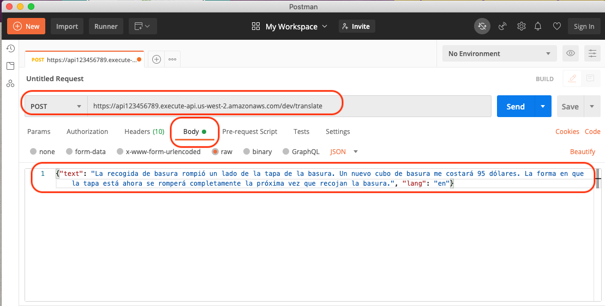
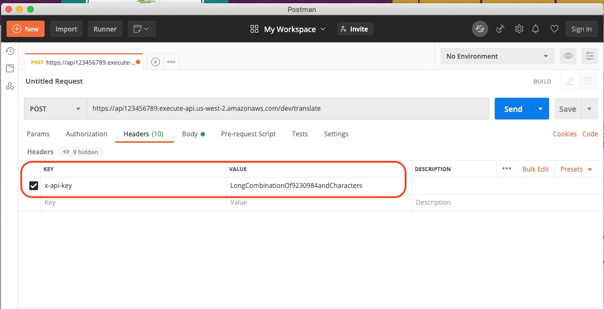

### Overview

A simple [Serverless Framework](https://www.serverless.com/) service that will translate a body of text into Spanish. It uses [Amazon API Gateway](https://aws.amazon.com/api-gateway/) as the entry point, [AWS Lambda](https://aws.amazon.com/lambda/) to process the request, and [Amazon Translate](https://aws.amazon.com/translate/) to execute the translation.


### Prerequisites

To deploy this service, you'll need to first install the Serverless Framework. The best way to do this is to follow the [Getting Started](https://www.serverless.com/framework/docs/getting-started/) documentation.

In addition to the serverless CLI, you'll also need to have AWS credentials to allow the deployment of the service into your environment. Follow the instructions on how to [install the AWS CLI](https://docs.aws.amazon.com/cli/latest/userguide/cli-chap-install.html), and subsequently [configure the CLI](https://docs.aws.amazon.com/cli/latest/userguide/cli-chap-configure.html) for use.

### Installing

Once the prerequisites are installed, you'll use the Serverless CLI to deploy the service into your account.

After you clone this repository, run the following command from the directory source:

```bash
serverless deploy --verbose
```

This will deploy the service into the region `us-west-2` with a stage of `dev`. If you wish to change these, you can specify them as arguments to your deployment command, e.g.:

```bash
serverless deploy --verbose --region <your-region> --stage <your-stage>
```

### Testing the Endpoint

Once deployed, you will see output similar to the following:

```
Service Information
service: get-it-done-translate
stage: dev
region: us-west-2
stack: get-it-done-translate-dev
resources: 19
api keys:
  devAPIKey: LongCombinationOf9230984andCharacters
endpoints:
  POST - https://api123456789.execute-api.us-west-2.amazonaws.com/dev/translate
functions:
  translate: get-it-done-translate-dev-translate
layers:
  None
```

Take note of the API key and the endpoint. In a tool like [Postman](https://www.postman.com/), you'll want to specify the following:

- Sepcify the endpoint from above
- Change the METHOD to `POST`
- In the body, specify a JSON object like the following:

```json
{
  "text": "La recogida de basura rompió un lado de la tapa de la basura.",
  "lang": "en"
}
```



- Specify a header of `x-api-key` with the value of the `devAPIKey` from above:
  

### Troubleshooting

When troubleshooting the API, it might be helpful to watch the output that is sent to CloudWatch Logs. You can easily do this directly from the CLI:

```bash
serverless logs -f translate -t
```
